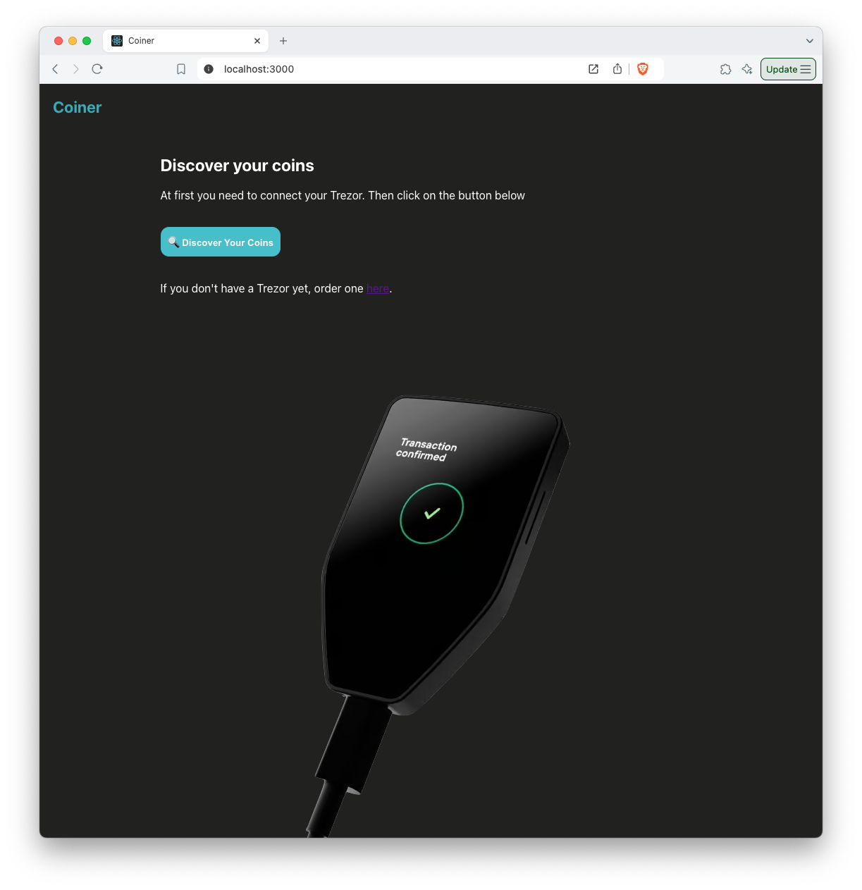
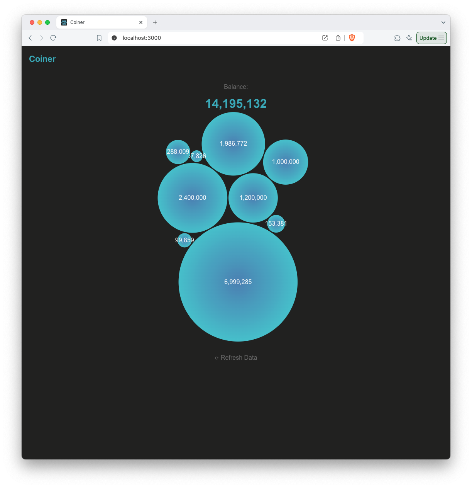
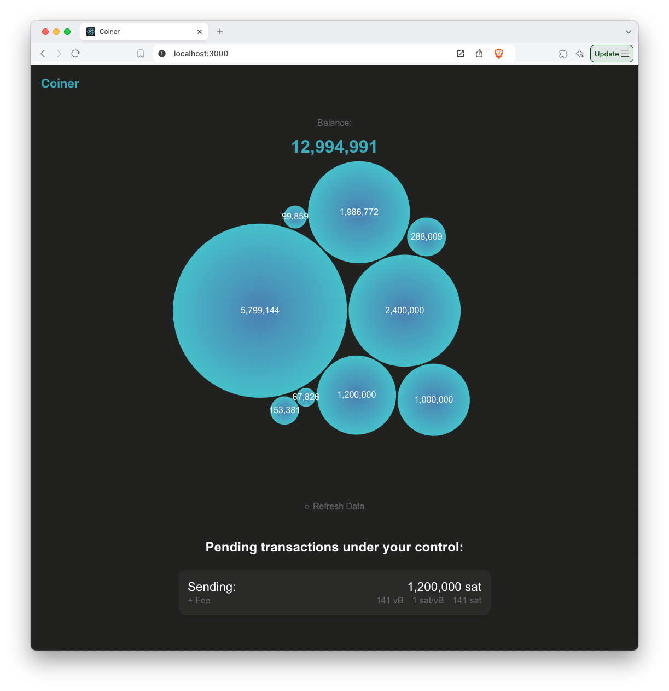
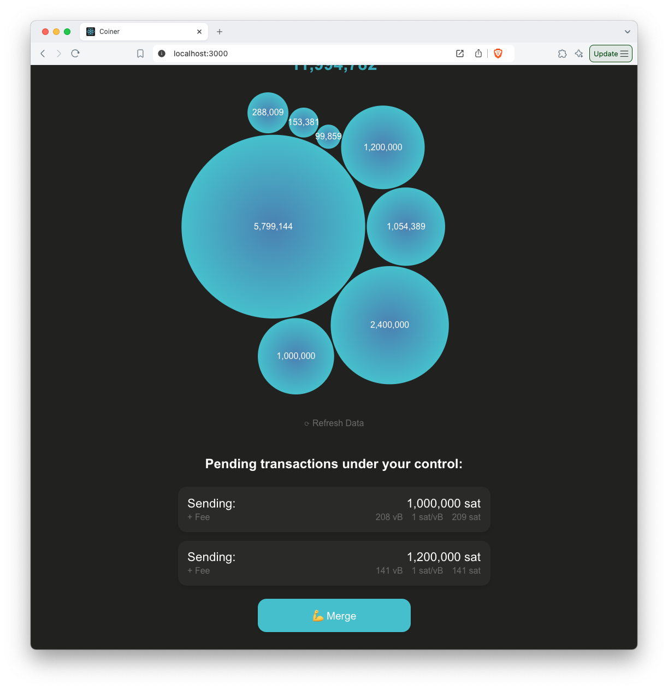
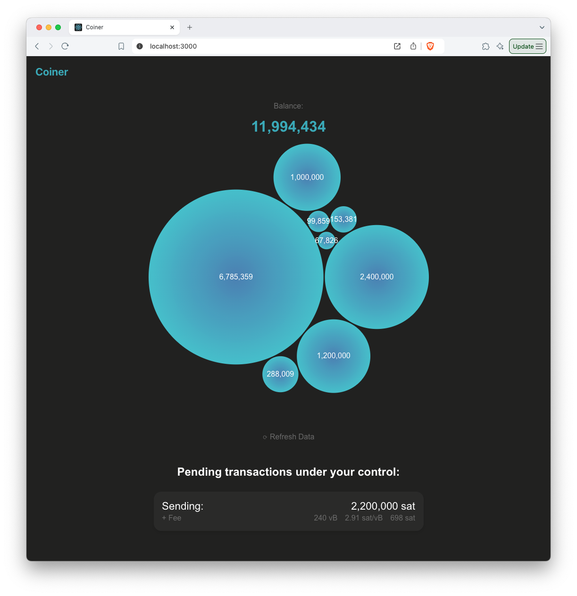

# Coiner

⚠️ This is hobby tool without any guarantee. Use it with caution!

Purpose of this tool is to provide option to merge all your pending transactions into one. Potentially including other features to save on mining fees.
You will need to purchase a [Trezor](https://trezor.io/) device to use Coiner app.

### 💪 List of features

- [x] See your valid coins as a bubbles
- [ ] Build consolidation transaction
- [x] Merge pending transactions
- [ ] Include foreign child transaction in merging
- [ ] Cancel pending transactions
- [ ] Bitcoin mainnet
- [ ] Select account

### 🚫 Not planned features (as of now)

- Multiple accounts
- Passphrase support
- Fiat currencties
- Generate receive address
- Compose send transaction
- Export/Import PSBT
- BTC units
- Pretty web design

Run the project with command: `yarn start`

Live version of the app is available on https://coiner-mu.vercel.app/

### Current Flow

- as of 30.9.2024

| Screen                                                 | Description                                                               |
| ------------------------------------------------------ | ------------------------------------------------------------------------- |
|    | First you need to connect any Trezor device                               |
|  | Add passphrase if needed, select your account, and see your coins         |
|     | Here is visible firs pending transaction (broadcasted from different app) |
|    | Second pending transaction introduces option to merge them                |
|            | Pending merged transaction                                                |
